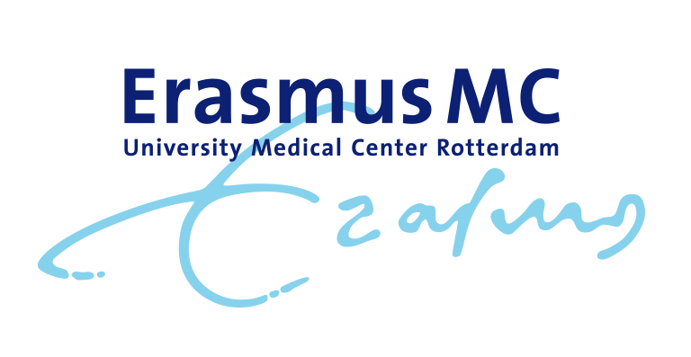

<link rel="shortcut icon" type="image/x-icon" href="/favicon.ico">

We have a team of experienced bioinformaticians to run advanced analysis pipelines. Our services include specialised data analysis for genotyping arrays, methylation arrays, Olink proteomics, and sequencing. We also offer consultancy and support if you choose to analyse the data yourself.

More information about the Erasmus MC Genomics Core Facilty is available on our website: [https://genomicserasmusmc.nl](https://genomicserasmusmc.nl/).

# Genomics
_On [our webiste](https://genomicserasmusmc.nl/services?category=genomics) you can find more information on our genomics lab services_

- ## DNA sequencing

<h4 style="display:inline-block"> Whole Exome Sequencing - Illumina </h4>

more info later

<h4 style="display:inline-block">Whole Genome Sequencing - Illumina </h4>

more info later

<h4 style="display:inline-block">Whole Genome Sequencing - Nanopore </h4>

more info later

- ## Genotyping arrays

<h4 style="display:inline-block">Genotyping array technical QC </h4>

more info later

<h4 style="display:inline-block">Genotyping array extended QC</h4>

more info later

<h4 style="display:inline-block">Genotype Imputations </h4>

more info later

<h4 style="display:inline-block">GWAS </h4>

more info later

<h4 style="display:inline-block">HLA imputations </h4>

more info later

<h4 style="display:inline-block">CNV analysis </h4>

more info later

<h4 style="display:inline-block">Genotype dataset merging</h4>

more info later

<h4 style="display:inline-block">Pharmacogenetics (PGx)</h4>

more info later

<h4 style="display:inline-block">Clusterfile generation - Illumina arrays </h4>

more info later

# Transcriptomics
_On [our webiste](https://genomicserasmusmc.nl/services?category=transcriptomics) you can find more information on our transcriptomics lab services_
- ## RNA sequencing

<h4 style="display:inline-block">RNA bulk sequencing - Illumina </h4>

more info later

<h4 style="display:inline-block">miRNA  sequencing </h4>

more info later

<h4 style="display:inline-block">RNA differential abundance analysis</h4>

more info later

- ## Single cell sequencing

<h4 style="display:inline-block">Single cell RNA sequencing - Illumina</h4>

more info later

# Epigenetics
_On [our webiste](https://genomicserasmusmc.nl/services?category=epigenetics) you can find more information on our epicgenetics lab services_
- ## Methylation arrays

<h4 style="display:inline-block">Methylation array technical QC</h4>

more info later

<h4 style="display:inline-block">Methylation array extended QC</h4>

more info later

- ## DNA sequencing

<h4 style="display:inline-block">MeD-Seq</h4>

more info later

<h4 style="display:inline-block">CUT&Tag</h4>

more info later

<h4 style="display:inline-block">CUT&Run</h4>

more info later

<h4 style="display:inline-block">Omni-ATAC</h4>

more info later

<h4 style="display:inline-block">4C sequencing</h4>

more info later

<h4 style="display:inline-block">ChIP-seq</h4>

more info later

<h4 style="display:inline-block">CRISPRScreen</h4>

more info later

# Proteomics
_On [our webiste](https://genomicserasmusmc.nl/services?category=proteomics) you can find more information on our proteomics lab services_
- ## Olink proteomics

<h4 style="display:inline-block">Olink explore</h4>

more info later

<h4 style="display:inline-block">Olink reveal</h4>

more info later

<h4 style="display:inline-block">Olink HT</h4>

more info later

# Metagenomics
_On [our webiste](https://genomicserasmusmc.nl/services?category=microbiome) you can find more information on our metagenomics lab services_

- ## Microbiome sequencing

<h4 style="display:inline-block">16S sequencing - Illumina </h4>

more info later

# Consultancy and support
